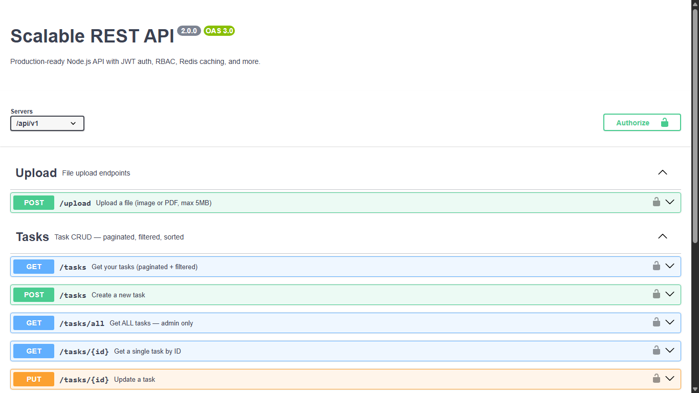
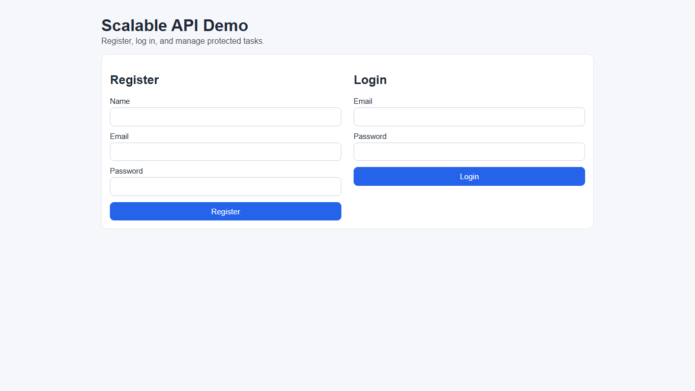

# Scalable REST API — Production Upgrade

A production-ready Node.js REST API built on top of the original `scalable-rest-api` project, upgraded with industry-standard tooling. **All tools are 100% free and open-source.**

## Screenshots

### Swagger API Documentation



### Frontend Demo



## What Was Added (vs Original)

| Feature | Original | Upgraded |
|---|---|---|
| Validation | express-validator | **Zod** (declarative schemas) |
| Logging | none | **Winston** + **Morgan** |
| Caching | none | **Redis** (ioredis) — per-user, auto-invalidated |
| Email | none | **Nodemailer** + **Bull** queue |
| File uploads | none | **Multer** (local disk, free) |
| Pagination | none | Full: page, limit, sortBy, order, search, filter |
| Background jobs | none | **Bull** queues (email, retries) |
| Error handling | basic | Typed `ApiError`, Prisma codes, JWT errors |
| Docker | none | **Dockerfile** + **docker-compose** |
| CI/CD | none | **GitHub Actions** |
| DB schema | basic | Indexes, email verify fields, reset token, `IN_PROGRESS` status |
| Response shape | inconsistent | Standardized `ApiResponse` |

## Tech Stack

- **Runtime:** Node.js 20, Express 5
- **Database:** PostgreSQL via **Prisma ORM**
- **Auth:** bcryptjs, jsonwebtoken
- **Validation:** **Zod**
- **Logging:** **Winston** + **Morgan**
- **Caching:** **Redis** (ioredis)
- **Email:** **Nodemailer** (Mailtrap dev / Gmail prod)
- **Queues:** **Bull** (Redis-backed)
- **File Upload:** **Multer** (local disk)
- **Docs:** Swagger (swagger-jsdoc + swagger-ui-express)
- **Security:** helmet, express-rate-limit, compression, cors

## Project Structure

```
scalable-rest-api/
├── prisma/
│   ├── schema.prisma          # DB schema with indexes
│   └── seed.js                # Seed data (admin + user + tasks)
├── public/                    # Vanilla JS frontend
├── src/
│   ├── config/
│   │   ├── env.js             # Zod-validated env loader
│   │   ├── prisma.js          # Prisma client singleton
│   │   ├── logger.js          # Winston logger
│   │   ├── redis.js           # ioredis client
│   │   ├── mailer.js          # Nodemailer transporter
│   │   └── swagger.js         # Swagger setup
│   ├── middlewares/
│   │   ├── auth.middleware.js          # JWT authenticate
│   │   ├── rbac.middleware.js          # authorize(...roles)
│   │   ├── validate.middleware.js      # Zod schema runner
│   │   ├── cache.middleware.js         # Redis cache + invalidation
│   │   ├── upload.middleware.js        # Multer config
│   │   ├── error.middleware.js         # Centralized error handler
│   │   └── requestLogger.middleware.js # Morgan → Winston
│   ├── modules/
│   │   ├── auth/
│   │   │   ├── auth.schema.js      # Zod schemas
│   │   │   ├── auth.service.js     # Business logic
│   │   │   ├── auth.controller.js  # Request handlers
│   │   │   └── auth.routes.js      # Routes + Swagger docs
│   │   ├── task/
│   │   │   ├── task.schema.js
│   │   │   ├── task.service.js
│   │   │   ├── task.controller.js
│   │   │   └── task.routes.js
│   │   └── upload/
│   │       └── upload.routes.js
│   ├── utils/
│   │   ├── ApiError.js       # Custom error class
│   │   ├── ApiResponse.js    # Standardized response
│   │   ├── asyncHandler.js   # Async route wrapper
│   │   ├── paginate.js       # Pagination helpers
│   │   └── token.js          # JWT sign/verify
│   ├── jobs/
│   │   ├── queue.js          # Bull queue setup
│   │   └── emailJob.js       # Email processor + queueEmail()
│   ├── app.js                # Express app (middleware stack)
│   ├── routes.js             # Root router
│   └── server.js             # Server + graceful shutdown
├── uploads/                  # Uploaded files (gitignored)
├── logs/                     # Winston log files (gitignored)
├── .github/workflows/ci.yml  # GitHub Actions CI
├── Dockerfile
├── docker-compose.yml
└── .env.example
```

## Quick Start

### 1. Clone and install

```bash
git clone https://github.com/AnoushkaNavale/scalable-rest-api.git
cd scalable-rest-api
npm install
```

### 2. Configure environment

```bash
cp .env.example .env
# Edit .env — at minimum set DATABASE_URL and JWT_SECRET
```

### 3. Start PostgreSQL + Redis (Docker)

```bash
# If you have Docker:
docker run -d -p 5432:5432 -e POSTGRES_PASSWORD=postgres -e POSTGRES_DB=scalable_api postgres:16-alpine
docker run -d -p 6379:6379 redis:7-alpine

# Or install PostgreSQL and Redis locally
```

### 4. Run migrations and seed

```bash
npm run prisma:generate
npm run prisma:migrate
npm run prisma:seed
```

### 5. Start dev server

```bash
npm run dev
```

## Seed Credentials

| Role  | Email              | Password    |
|-------|--------------------|-------------|
| ADMIN | admin@example.com  | Admin@1234  |
| USER  | user@example.com   | User@1234   |

## API Endpoints

### Auth (`/api/v1/auth`)

| Method | Path               | Auth | Description |
|--------|--------------------|------|-------------|
| POST   | /register          | ❌   | Register new user |
| POST   | /login             | ❌   | Login, get JWT |
| GET    | /verify-email      | ❌   | Verify email with token |
| POST   | /forgot-password   | ❌   | Request reset email |
| POST   | /reset-password    | ❌   | Reset with token |
| GET    | /me                | ✅   | Get current user |

### Tasks (`/api/v1/tasks`)

| Method | Path     | Auth       | Description |
|--------|----------|------------|-------------|
| GET    | /        | USER+ADMIN | Own tasks (paginated) |
| GET    | /all     | ADMIN only | All tasks (paginated) |
| GET    | /:id     | USER+ADMIN | Single task |
| POST   | /        | USER+ADMIN | Create task |
| PUT    | /:id     | USER+ADMIN | Update task |
| DELETE | /:id     | USER+ADMIN | Delete task |

#### Query params for GET list endpoints:
```
?page=1&limit=10&sortBy=createdAt&order=desc&status=PENDING&search=fix
```

### Upload (`/api/v1/upload`)

| Method | Path | Auth | Description |
|--------|------|------|-------------|
| POST   | /    | ✅   | Upload file (multipart/form-data, field: `file`) |

### Other

| Path | Description |
|------|-------------|
| `GET /api/v1/health` | Health check |
| `GET /api-docs` | Swagger UI |

## Run with Docker Compose

```bash
docker compose up --build

# In another terminal, run migrations + seed
docker compose exec app npx prisma migrate deploy
docker compose exec app node prisma/seed.js
```

## Email Setup (Free Options)

**Development** — [Mailtrap](https://mailtrap.io) (free, 1000 emails/month):
```env
MAIL_HOST=smtp.mailtrap.io
MAIL_PORT=2525
MAIL_USER=<your mailtrap username>
MAIL_PASS=<your mailtrap password>
```

**Production** — Gmail SMTP (free, 500/day):
```env
MAIL_HOST=smtp.gmail.com
MAIL_PORT=587
MAIL_USER=youraddress@gmail.com
MAIL_PASS=<gmail app password>  # Generate at myaccount.google.com/apppasswords
```

## Redis Setup (Free Options)

- **Local:** `docker run -p 6379:6379 redis:7-alpine`
- **Cloud free tier:** [Redis Cloud](https://redis.io/try-free/) — 30MB free

The app **gracefully degrades** if Redis is unavailable — cache middleware catches errors and passes requests through.

## Deploy to Render (Free)

1. Push repo to GitHub
2. [render.com](https://render.com) → New → Web Service → connect repo
3. Build: `npm ci && npx prisma generate && npx prisma migrate deploy`
4. Start: `node src/server.js`
5. Add PostgreSQL from Render dashboard (free tier)
6. Add Redis Cloud free tier URL
7. Set all env vars in Render Environment tab

## Database Schema

```prisma
model User {
  id               String    @id @default(cuid())
  name             String
  email            String    @unique
  password         String
  role             Role      @default(USER)     // USER | ADMIN
  emailVerified    Boolean   @default(false)
  verifyToken      String?
  resetToken       String?
  resetTokenExpiry DateTime?
  tasks            Task[]

  @@index([email])
  @@index([resetToken])
}

model Task {
  id          String   @id @default(cuid())
  title       String
  description String?
  status      Status   @default(PENDING)   // PENDING | IN_PROGRESS | COMPLETED
  userId      String
  user        User     @relation(...)

  @@index([userId])
  @@index([status])
  @@index([userId, status])         // composite for filtered queries
  @@index([createdAt(sort: Desc)])
}
```
